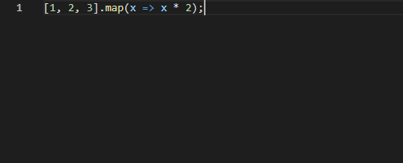
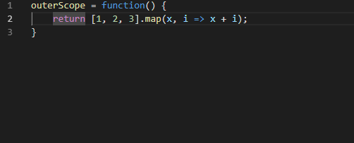

# arrow-function-converter README

Convert ES6 one line arrow function to multiline.

Used for enriching the function/debugging, simple and can work from wherever you are in the line :)

`Alt+Shift+K` to activate

## Demos

